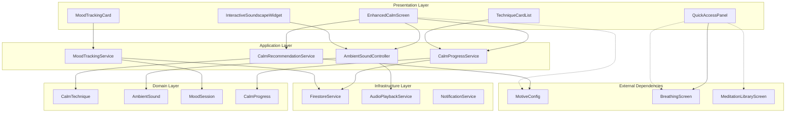

# Design Document: Calm Tab Enhancement

## Overview

The Calm Tab Enhancement transforms the existing calm screen into a comprehensive anxiety relief and wellness hub. This design builds upon the foundational implementation already started, including the EnhancedCalmScreen, InteractiveSoundscapeWidget, AmbientSoundController, and CalmProgressService. The enhancement focuses on motive-based personalization, ambient soundscapes, progress tracking, and seamless integration with the existing app ecosystem.

### Key Design Principles

1. **Motive-Driven Personalization**: Every aspect adapts to the user's primary wellness motive (Sleep, Stress, Anxiety, Focus, Habit Building)
2. **Non-Conflicting Integration**: Complements existing Breathing and Meditation features without duplication
3. **Progressive Enhancement**: Builds incrementally without breaking existing functionality
4. **Accessibility-First**: Ensures full accessibility compliance from the ground up
5. **Performance Optimization**: Efficient resource management for smooth user experience

## Architecture

### System Architecture Overview



### Component Relationships

The architecture follows a clean separation of concerns with clear boundaries:

- **Presentation Layer**: UI components that handle user interaction and display
- **Application Layer**: Business logic and state management controllers
- **Domain Layer**: Core business entities and models
- **Infrastructure Layer**: External service integrations and data persistence

### Integration Points

1. **MotiveConfig Integration**: Leverages existing motive system for personalization
2. **Breathing Screen Integration**: Quick access without duplication
3. **Meditation Library Integration**: Complementary technique recommendations
4. **Progress System Integration**: Unified analytics and badge system
5. **Notification System Integration**: Calm reminders and achievements

## Components and Interfaces

### Core Components

#### 1. EnhancedCalmScreen (Already Implemented)
**Purpose**: Main calm tab interface with motive-based personalization
**Key Features**:
- Motive-specific welcome headers and color themes
- Quick access emergency panel
- Personalized technique recommendations
- Ambient soundscape integration

**Interface**:
```dart
class EnhancedCalmScreen extends ConsumerStatefulWidget {
  const EnhancedCalmScreen({super.key});
}
```

#### 2. InteractiveSoundscapeWidget (Already Implemented)
**Purpose**: Ambient sound mixing and playback interface
**Key Features**:
- Motive-based sound recommendations
- Multi-sound mixing with individual volume controls
- Timer functionality with fade-out
- Visual feedback for active sounds

**Interface**:
```dart
class InteractiveSoundscapeWidget extends ConsumerStatefulWidget {
  final String? userMotive;
  final Color primaryColor;
  
  const InteractiveSoundscapeWidget({
    super.key,
    this.userMotive,
    this.primaryColor = const Color(0xFF4DB6AC),
  });
}
```

#### 3. AmbientSoundController (Already Implemented)
**Purpose**: State management for ambient sound playback
**Key Features**:
- Sound activation/deactivation
- Volume control (master and individual)
- Timer management
- Motive-based recommendations

**Interface**:
```dart
class AmbientSoundController extends StateNotifier<AmbientSoundState> {
  void toggleSound(String soundId);
  void setMasterVolume(double volume);
  void setSoundVolume(String soundId, double volume);
  void setTimer(int? minutes);
  void stopAllSounds();
  List<AmbientSound> getRecommendedSounds(String? motive);
}
```

#### 4. CalmProgressService (Already Implemented)
**Purpose**: Progress tracking and analytics for calm techniques
**Key Features**:
- Technique completion logging
- Usage statistics calculation
- Streak tracking
- Effectiveness analysis

**Interface**:
```dart
class CalmProgressService {
  Future<void> logTechniqueCompletion({
    required String userId,
    required String techniqueId,
    required String techniqueName,
    required int durationMinutes,
    int? preMoodRating,
    int? postMoodRating,
  });
  
  Future<Map<String, dynamic>> getUserStats(String userId);
  Future<Map<String, double>> getTechniqueEffectiveness(String userId);
  Stream<List<Map<String, dynamic>>> getRecentSessions(String userId);
}
```

### New Components to Implement

#### 5. CalmRecommendationService
**Purpose**: AI-like personalized technique recommendations
**Key Features**:
- Motive-based technique prioritization
- Time-of-day recommendations
- Effectiveness-based suggestions
- Usage pattern analysis

**Interface**:
```dart
class CalmRecommendationService {
  Future<List<CalmTechnique>> getPersonalizedRecommendations(
    String userId,
    String? motive,
  );
  
  Future<List<CalmTechnique>> getQuickAccessTechniques(
    String userId,
    String? motive,
  );
  
  Future<CalmTechnique?> getEmergencyTechnique(
    String userId,
    String? motive,
  );
}
```

#### 6. MoodTrackingService
**Purpose**: Pre/post technique mood tracking and analysis
**Key Features**:
- Mood rating collection
- Improvement calculation
- Trend analysis
- Integration with technique effectiveness

**Interface**:
```dart
class MoodTrackingService {
  Future<void> recordPreMood(String sessionId, int rating);
  Future<void> recordPostMood(String sessionId, int rating);
  Future<Map<String, dynamic>> getMoodTrends(String userId);
  Future<double> getAverageMoodImprovement(String userId);
}
```

#### 7. AudioPlaybackService
**Purpose**: Actual audio playback implementation for ambient sounds
**Key Features**:
- Multi-track audio mixing
- Volume control per track
- Timer-based fade out
- Background playback support

**Interface**:
```dart
class AudioPlaybackService {
  Future<void> playSound(String soundId, double volume);
  Future<void> stopSound(String soundId);
  Future<void> setVolume(String soundId, double volume);
  Future<void> setMasterVolume(double volume);
  Future<void> startTimer(int minutes);
  Stream<Set<String>> get activeSounds;
}
```

#### 8. CalmNotificationService
**Purpose**: Intelligent calm reminders and achievements
**Key Features**:
- Motive-specific reminder scheduling
- Achievement notifications
- Streak celebration
- Emergency technique suggestions

**Interface**:
```dart
class CalmNotificationService {
  Future<void> scheduleMotiveReminders(String userId, String motive);
  Future<void> sendAchievementNotification(String userId, String achievement);
  Future<void> sendStreakCelebration(String userId, int streakDays);
  Future<void> cancelAllReminders(String userId);
}
```

## Data Models

### Core Models (Already Implemented)

#### CalmTechnique
```dart
enum TechniqueType { grounding, affirmation, breathing, visualization }

class CalmTechnique {
  final String id;
  final String title;
  final String description;
  final String icon;
  final TechniqueType type;
  final int durationMinutes;
  final List<String>? steps;
  final List<String>? content;
}
```

#### AmbientSound
```dart
enum SoundCategory { nature, urban, noise, traditional }

class AmbientSound {
  final String id;
  final String name;
  final String emoji;
  final SoundCategory category;
  final String description;
}
```

#### AmbientSoundState
```dart
class AmbientSoundState {
  final Set<String> activeSounds;
  final double masterVolume;
  final Map<String, double> individualVolumes;
  final int? timerMinutes;
  final bool isPlaying;
}
```

### New Models to Implement

#### MoodSession
```dart
class MoodSession {
  final String id;
  final String userId;
  final String techniqueId;
  final int? preMoodRating;
  final int? postMoodRating;
  final DateTime startTime;
  final DateTime? endTime;
  final int? moodImprovement;
  
  const MoodSession({
    required this.id,
    required this.userId,
    required this.techniqueId,
    this.preMoodRating,
    this.postMoodRating,
    required this.startTime,
    this.endTime,
    this.moodImprovement,
  });
}
```

#### CalmProgress
```dart
class CalmProgress {
  final String userId;
  final int totalSessions;
  final int totalMinutes;
  final double averageMoodImprovement;
  final String? favoriteTechnique;
  final int currentStreak;
  final Map<String, int> techniqueUsage;
  final Map<String, double> techniqueEffectiveness;
  
  const CalmProgress({
    required this.userId,
    required this.totalSessions,
    required this.totalMinutes,
    required this.averageMoodImprovement,
    this.favoriteTechnique,
    required this.currentStreak,
    required this.techniqueUsage,
    required this.techniqueEffectiveness,
  });
}
```

#### CalmRecommendation
```dart
class CalmRecommendation {
  final CalmTechnique technique;
  final double confidenceScore;
  final String reason;
  final RecommendationType type;
  
  const CalmRecommendation({
    required this.technique,
    required this.confidenceScore,
    required this.reason,
    required this.type,
  });
}

enum RecommendationType {
  motiveBasedPriority,
  timeOfDay,
  effectiveness,
  emergency,
  complementary,
}
```

#### SoundPreset
```dart
class SoundPreset {
  final String id;
  final String name;
  final String motive;
  final Set<String> soundIds;
  final Map<String, double> volumes;
  final double masterVolume;
  
  const SoundPreset({
    required this.id,
    required this.name,
    required this.motive,
    required this.soundIds,
    required this.volumes,
    required this.masterVolume,
  });
}
```

### Data Persistence Schema

#### Firestore Collections

**calm_sessions**
```json
{
  "userId": "string",
  "techniqueId": "string",
  "techniqueName": "string",
  "durationMinutes": "number",
  "completedAt": "timestamp",
  "preMoodRating": "number?",
  "postMoodRating": "number?",
  "moodImprovement": "number?",
  "motive": "string?"
}
```

**sound_presets**
```json
{
  "userId": "string",
  "presetId": "string",
  "name": "string",
  "motive": "string",
  "soundIds": ["string"],
  "volumes": {"soundId": "number"},
  "masterVolume": "number",
  "createdAt": "timestamp"
}
```

**calm_preferences**
```json
{
  "userId": "string",
  "favoritePresets": ["string"],
  "defaultTimer": "number",
  "reminderSettings": {
    "enabled": "boolean",
    "times": ["string"],
    "motive": "string"
  },
  "accessibilitySettings": {
    "audioGuidanceOnly": "boolean",
    "highContrast": "boolean",
    "reducedMotion": "boolean"
  }
}
```

## Correctness Properties

*A property is a characteristic or behavior that should hold true across all valid executions of a system-essentially, a formal statement about what the system should do. Properties serve as the bridge between human-readable specifications and machine-verifiable correctness guarantees.*

### Property 1: Motive-Based System Personalization

*For any* user motive (Sleep, Stress, Anxiety, Focus, Habit Building), the calm system should adapt all personalization elements including technique priorities, color themes, welcome messages, sound recommendations, and quick access panel content to match the motive configuration from MotiveConfig.

**Validates: Requirements 2.3, 5.7, 19.2-19.10, 20.1-20.7, 21.1, 21.3**

### Property 2: Technique Library Completeness and Organization

*For any* technique library query, the system should provide at least 12 techniques across 4 categories (grounding, affirmation, breathing, visualization), with motive-prioritized ordering while maintaining access to all techniques.

**Validates: Requirements 2.1, 2.6, 2.8**

### Property 3: Ambient Sound System Functionality

*For any* ambient sound interaction, the system should support at least 15 sounds across 4 categories, allow multi-sound mixing with individual volume controls, provide visual feedback for active sounds, and continue playback across screen navigation.

**Validates: Requirements 3.1, 3.2, 3.4, 3.7**

### Property 4: Audio Metadata Round-Trip Integrity

*For any* valid audio file, parsing metadata then formatting for display then parsing again should produce equivalent metadata (round-trip property).

**Validates: Requirements 16.4**

### Property 5: Progress Tracking Accuracy

*For any* technique completion, the system should record accurate timestamp, duration, and mood data, calculate correct statistics (streaks, effectiveness, trends), and integrate properly with the existing badge system.

**Validates: Requirements 6.1-6.6**

### Property 6: Recommendation Engine Intelligence

*For any* user with usage history and motive, the recommendation engine should provide 2-3 personalized suggestions that consider time of day, technique effectiveness, mood data, and motive priorities, updating appropriately as new data becomes available.

**Validates: Requirements 5.1-5.6**

### Property 7: Quick Access Emergency Panel Effectiveness

*For any* emergency panel access, the system should provide 3-4 techniques under 2 minutes duration, enable immediate technique start without navigation delays, and adapt content based on user's most effective emergency techniques.

**Validates: Requirements 7.1-7.5**

### Property 8: Mood Tracking Integration

*For any* technique session, the system should prompt for pre-session mood rating (1-10 scale), request post-session rating upon completion, calculate accurate improvement scores, and integrate mood data with recommendation algorithms.

**Validates: Requirements 8.1-8.6**

### Property 9: Offline Capability Completeness

*For any* offline usage scenario, the system should maintain full functionality for core techniques and cached sounds, store preferences and progress locally, queue data for synchronization, and clearly indicate offline status and available features.

**Validates: Requirements 9.1-9.6**

### Property 10: Audio System Robustness

*For any* audio playback scenario, the system should support MP3/AAC/OGG formats, validate file integrity, handle interruptions gracefully, provide timer-based fade-out over 10 seconds, and support streaming for large files.

**Validates: Requirements 16.1-16.3, 16.5-16.7, 3.5**

### Property 11: Navigation Integration Consistency

*For any* navigation from calm features, the system should provide direct access to existing BreathingScreen and meditation features without duplicating functionality, while maintaining integration with existing analytics systems.

**Validates: Requirements 4.1-4.4, 4.6**

### Property 12: Dynamic Motive Adaptation

*For any* motive change in user profile, the system should automatically refresh within 5 seconds, smoothly transition visual themes, preserve historical data, provide change explanations, and maintain cross-motive effectiveness tracking.

**Validates: Requirements 21.1-21.7**

### Property 13: Visual Consistency and Responsiveness

*For any* screen size or animation trigger, the system should maintain consistent color theming with primary teal (#4DB6AC), provide staggered entrance animations for technique cards, and adapt layouts responsively across different device sizes.

**Validates: Requirements 1.2, 1.3, 1.5**

### Property 14: Sound Preset Management

*For any* sound combination created by users, the system should save presets with accurate volume settings, provide motive-specific preset recommendations, and enable quick recall of preferred combinations.

**Validates: Requirements 3.6, 3.10**

## Error Handling

### Error Categories and Strategies

#### 1. Network Connectivity Errors
**Strategy**: Graceful degradation with offline functionality
- Cache essential content for offline use
- Queue data synchronization for when connectivity returns
- Provide clear offline status indicators
- Maintain core functionality without network dependency

#### 2. Audio Playback Errors
**Strategy**: Robust fallback mechanisms
- Validate audio files before playback attempts
- Provide descriptive error messages for unsupported formats
- Handle audio interruptions (calls, notifications) gracefully
- Implement automatic retry with exponential backoff for transient failures

#### 3. Data Persistence Errors
**Strategy**: Data integrity protection
- Implement local backup for critical user data (preferences, progress)
- Use atomic operations for data updates
- Provide data recovery mechanisms for corrupted local storage
- Validate data integrity before persistence operations

#### 4. Motive Configuration Errors
**Strategy**: Safe defaults and validation
- Provide sensible defaults when motive data is unavailable
- Validate motive configuration before applying personalization
- Handle missing or invalid motive gracefully with generic experience
- Log configuration errors for debugging without user impact

#### 5. Recommendation Engine Errors
**Strategy**: Fallback to basic recommendations
- Provide default technique recommendations when personalization fails
- Handle insufficient data scenarios with motive-based defaults
- Implement circuit breaker pattern for recommendation service failures
- Cache last successful recommendations as fallback

### Error Recovery Patterns

#### Automatic Recovery
```dart
class ErrorRecoveryService {
  Future<T> withRetry<T>(
    Future<T> Function() operation,
    {int maxRetries = 3, Duration delay = const Duration(seconds: 1)}
  ) async {
    for (int attempt = 0; attempt < maxRetries; attempt++) {
      try {
        return await operation();
      } catch (e) {
        if (attempt == maxRetries - 1) rethrow;
        await Future.delayed(delay * (attempt + 1));
      }
    }
    throw Exception('Max retries exceeded');
  }
}
```

#### User-Initiated Recovery
- Provide "Retry" buttons for failed operations
- Offer manual sync options for data synchronization
- Enable cache clearing for persistent issues
- Include "Reset to defaults" option for configuration problems

#### Graceful Degradation
- Core techniques remain available even when personalization fails
- Basic sound playback continues when advanced mixing fails
- Simple progress tracking when detailed analytics are unavailable
- Generic recommendations when personalized suggestions fail

## Testing Strategy

### Dual Testing Approach

The testing strategy employs both unit testing and property-based testing as complementary approaches to ensure comprehensive coverage and system correctness.

#### Unit Testing Focus
Unit tests target specific examples, edge cases, and integration points:

- **Specific Examples**: Test concrete scenarios like "Sleep motive user sees Body Scan technique first"
- **Edge Cases**: Handle boundary conditions like empty technique lists or invalid audio files
- **Integration Points**: Verify connections between calm system and existing breathing/meditation features
- **Error Conditions**: Test specific failure scenarios and recovery mechanisms

#### Property-Based Testing Focus
Property tests verify universal properties across all inputs through randomization:

- **Motive Personalization**: Generate random motives and verify consistent personalization behavior
- **Audio Processing**: Test audio parsing with randomly generated metadata and file formats
- **Progress Calculations**: Verify statistical accuracy across random usage patterns
- **Recommendation Logic**: Test recommendation algorithms with varied user histories and preferences

### Property-Based Testing Configuration

**Library Selection**: Use the `test` package with custom property testing utilities for Dart/Flutter

**Test Configuration**:
- Minimum 100 iterations per property test (due to randomization)
- Each property test references its design document property
- Tag format: **Feature: calm-tab-enhancement, Property {number}: {property_text}**

**Example Property Test Structure**:
```dart
testWidgets('Feature: calm-tab-enhancement, Property 1: Motive-Based System Personalization', (tester) async {
  // Generate random motive
  final motive = generateRandomMotive();
  
  // Set up system with motive
  await setupCalmSystemWithMotive(tester, motive);
  
  // Verify all personalization elements match motive configuration
  expect(getTechniqueOrder(), matchesMotivePriorities(motive));
  expect(getColorTheme(), matchesMotiveColors(motive));
  expect(getWelcomeMessage(), containsMotiveElements(motive));
  expect(getSoundRecommendations(), matchesMotiveSounds(motive));
});
```

### Integration Testing Strategy

#### Cross-Feature Integration
- Test calm system integration with existing breathing and meditation features
- Verify progress data flows correctly to unified analytics dashboard
- Test notification system integration for calm reminders and achievements
- Validate motive configuration consistency across all app features

#### Performance Testing
- Load testing with multiple concurrent ambient sounds
- Memory usage validation during extended soundscape sessions
- Battery usage optimization verification
- Network efficiency testing for data synchronization

#### Accessibility Testing
- Screen reader compatibility verification
- High contrast mode functionality testing
- Voice control integration validation
- Motor impairment accommodation testing

### Test Data Management

#### Mock Data Generation
```dart
class CalmTestDataGenerator {
  static CalmTechnique generateRandomTechnique() {
    return CalmTechnique(
      id: generateId(),
      title: generateTitle(),
      type: generateRandomTechniqueType(),
      durationMinutes: Random().nextInt(30) + 1,
    );
  }
  
  static String generateRandomMotive() {
    return ['Sleep', 'Stress', 'Anxiety', 'Focus', 'Habit Building']
        [Random().nextInt(5)];
  }
  
  static MoodSession generateRandomMoodSession() {
    return MoodSession(
      preMoodRating: Random().nextInt(10) + 1,
      postMoodRating: Random().nextInt(10) + 1,
      startTime: DateTime.now().subtract(Duration(minutes: Random().nextInt(60))),
    );
  }
}
```

#### Test Environment Setup
- Isolated test database for progress tracking tests
- Mock audio service for soundscape testing without actual audio playback
- Simulated network conditions for offline capability testing
- Controlled time progression for streak and analytics testing

### Continuous Integration Requirements

#### Automated Test Execution
- All property tests must pass with 100 iterations minimum
- Unit test coverage minimum 85% for new calm system components
- Integration tests run against staging environment before deployment
- Performance benchmarks validated against baseline metrics

#### Quality Gates
- No failing property tests allowed in main branch
- Accessibility compliance verification required
- Memory leak detection for audio components
- Battery usage impact assessment for ambient sound features

This comprehensive testing strategy ensures that the calm tab enhancement maintains high quality, reliability, and user experience while integrating seamlessly with the existing app ecosystem.