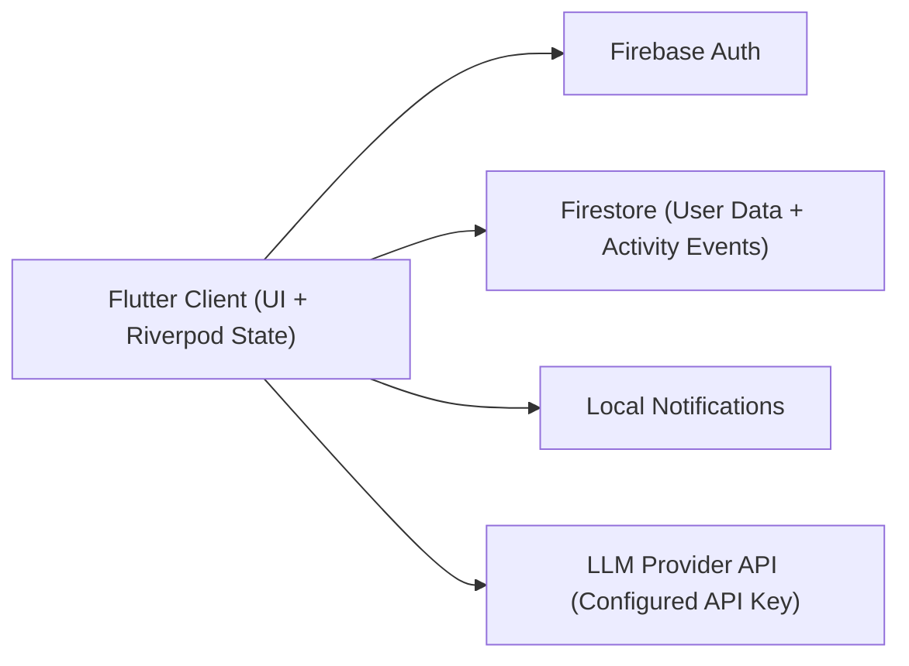

# MindNest

**MindNest: A Cross-Platform Mental Wellness App with Personalized Routines and Activity Analytics**

MindNest is a Flutter + Firebase mental wellness system designed for daily practice support through personalized routines, check-ins, journaling, meditation/focus sessions, and progress analytics.

This repository is prepared as both:
- an engineering project artifact
- a research-paper support artifact (reproducible build + evaluation guidance)

## 1. Research Abstract (Project Framing)

MindNest addresses a common gap in digital wellness tools: many apps provide isolated features (journal, breathing, timers), but few provide a unified personalized workflow with measurable daily activity tracking.  
The system combines onboarding-derived personalization, structured routine execution, and activity analytics in a single cross-platform mobile architecture.  
The implementation emphasizes practical deployability (Flutter + Firebase), user-level data isolation (rules-based ownership), and reproducible engineering workflows for academic reporting.

## 2. Problem Statement

Students and early professionals often struggle to maintain consistent wellness habits due to:
- fragmented tools
- low personalization
- weak progress visibility

MindNest aims to provide a single adaptive workflow from onboarding to daily completion tracking and insights.

## 3. Technical Contributions

The codebase currently supports the following defensible technical contributions:
- Cross-platform Flutter wellness app with multi-feature integration.
- Personalized routine flow based on onboarding profile and user motive.
- Activity event persistence and user-scoped analytics via Firestore.
- Owner-only Firestore and Storage access model with immutable ownership checks.
- Local on-device AI chat integration path using runtime configuration.
- Quality gate scripts for analyzer/tests/rules checks to improve reproducibility.

## 4. System Overview



### Core modules
- Authentication: Email/password + Google sign-in.
- Onboarding: motive, schedule, personalization baseline.
- Home/Routine: daily tasks, check-ins, guided actions.
- Wellness tools: meditation, focus, breathing, grounding.
- Journaling and goals: structured reflection and progress.
- Analytics/badges: streaks, completion trends, activity summaries.

## 5. Tech Stack

- Frontend: Flutter (Dart)
- State management: Riverpod
- Backend: Firebase Auth, Firestore
- Notifications: `flutter_local_notifications`
- Optional AI path: local chat model access via configured API key

## 6. Security Model Summary

- Firestore rules enforce authenticated, owner-only reads/writes for user-owned data.
- Critical collections enforce immutable `userId` ownership semantics.
- Storage rules follow owner-path model (`users/{uid}/...`) with validation constraints.

See:
- `firestore.rules`
- `storage.rules`

## 7. Reproducibility and Setup

### Prerequisites
- Flutter SDK
- Firebase CLI
- Java 21+ recommended for emulators

### Install

```bash
flutter pub get
```

### Generate logo-based app icon and native splash

```bash
dart run flutter_launcher_icons
dart run flutter_native_splash:create
```

Logo source path:
- `assets/images/app_logo.jpg`

### Firebase native configuration
- Android: add `android/app/google-services.json`
- iOS: add `ios/Runner/GoogleService-Info.plist`

### Run app

```bash
flutter run --dart-define=GEMINI_API_KEY=YOUR_KEY
```

### Optional web defines

```bash
flutter run -d chrome \
  --dart-define=FIREBASE_WEB_API_KEY=... \
  --dart-define=FIREBASE_WEB_APP_ID=... \
  --dart-define=FIREBASE_WEB_MESSAGING_SENDER_ID=... \
  --dart-define=FIREBASE_WEB_PROJECT_ID=... \
  --dart-define=FIREBASE_WEB_AUTH_DOMAIN=... \
  --dart-define=FIREBASE_WEB_STORAGE_BUCKET=...
```

## 8. Quality Gates (For Paper Appendix / Viva Defense)

Run local verification:

```bash
./tools/quality_gate.sh
./tools/firestore_rules_test.sh
```

PowerShell equivalents:
- `tools/quality_gate.ps1`
- `tools/firestore_rules_test.ps1`

Reference:
- `.github/workflows/flutter-quality-gate.yml`
- `docs/QUALITY_GATES.md`

## 9. Evaluation Plan for Research Paper

Recommended metrics to report:
- Feature action latency: p50/p95 (auth, check-in save, routine completion, journal save).
- Firestore operations per user session (read/write count).
- Crash-free sessions.
- Completion adherence (daily/weekly routine completion rate).
- Retention proxy (streak continuity distribution).
- AI chat fallback/error rate (if included in study).

Recommended tables/figures:
- Feature-to-architecture mapping table.
- Latency chart by feature flow.
- Cost estimate table (Firestore reads/writes per DAU scenario).
- User flow completion funnel.

## 10. Scope, Claims, and Limitations

### Claims supported by current implementation
- Feature-rich cross-platform prototype for mental wellness workflows.
- Personalized routine support with tracked activity analytics.
- Rule-based user data isolation model in Firebase.

### Claims not supported yet (avoid in paper)
- Clinical efficacy or therapeutic outcome claims.
- Large-scale production readiness without further load/security validation.
- Medical-grade intervention performance.

### Known limitations
- Limited large-scale performance benchmarking.
- Limited longitudinal user-study evidence.
- Some advanced hardening is still incremental.

## 11. Ethics and Privacy Notes

- No clinical diagnosis claims are made by the system.
- User-generated wellness content should be handled as sensitive data.
- Any study publication should include informed consent and anonymization process.
- Crisis support behavior should not be represented as professional medical care.

## 12. Repository Structure (High-Level)

- `lib/`: Flutter application (screens, features, services, models, widgets)
- `test/`: unit/integration/widget/rules-related tests
- `tools/`: quality gates and test helpers
- `docs/`: security and publication-readiness documentation

## 13. Paper-Ready Checklist

Before final submission/demo, complete:
- Final analyzer/test/rules pass with archived outputs.
- Updated architecture diagram and sanitized DB/rules screenshots.
- Metric table population from real runs.
- Limitation and threats-to-validity sections aligned with actual evidence.

Use:
- `docs/publication_readiness_playbook.md`

## 14. Citation (Template)

```bibtex
@software{mindnest2026,
  title  = {MindNest: A Cross-Platform Mental Wellness App with Personalized Routines and Activity Analytics},
  author = {Your Name},
  year   = {2026},
  note   = {Flutter/Firebase-based research prototype},
  url    = {https://github.com/your-repo/mindnest}
}
```
