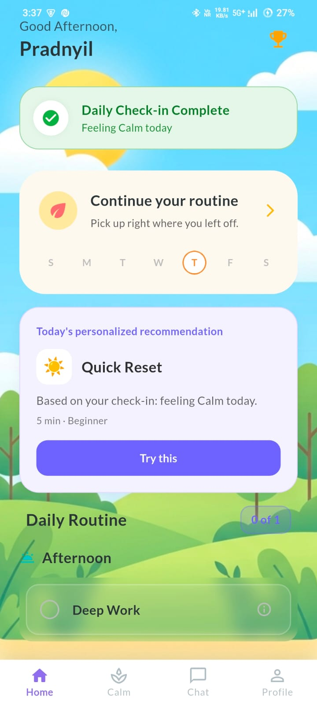
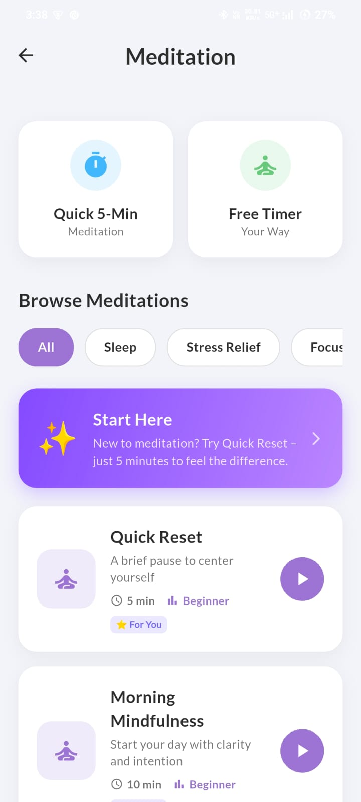
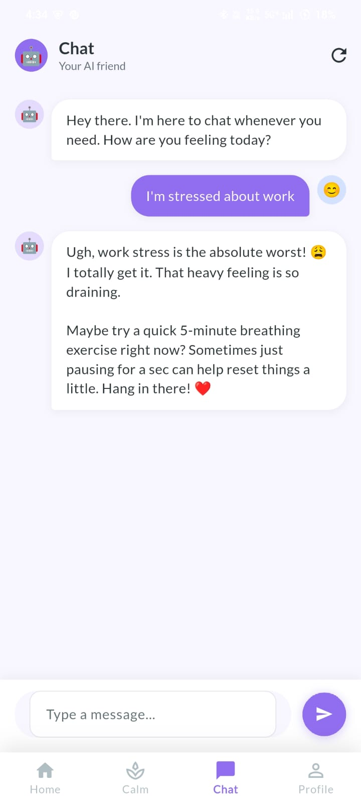
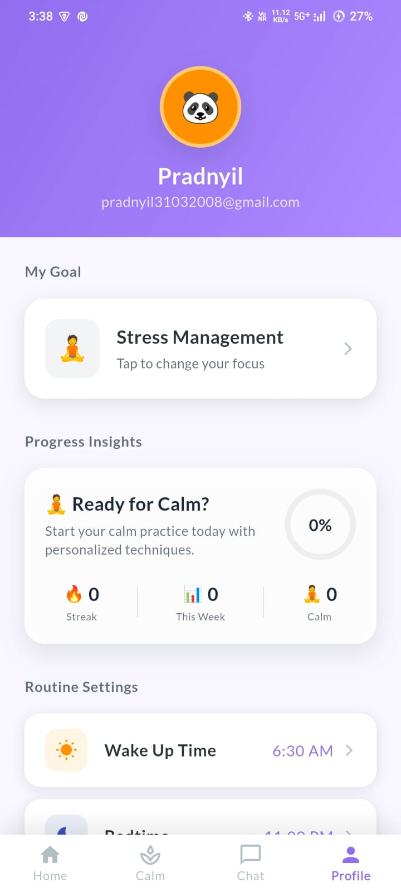

<div align="center">

# 🌿 MindNest

### Your Personal Mental Wellness Companion

[](https://flutter.dev)
[](https://dart.dev)
[](https://firebase.google.com)
[](https://flutter.dev)

**MindNest** is a cross-platform mobile app built with Flutter and Firebase that helps you build and maintain healthy mental wellness habits — through personalized routines, guided meditation, AI chat support, focus sessions, journaling, and progress analytics.

</div>

---

## 📸 Screenshots

<div align="center">
<table>
  <tr>
    <td align="center"><br/><b>Home</b></td>
    <td align="center"><br/><b>Meditation</b></td>
    <td align="center"><br/><b>AI Chat</b></td>
    <td align="center"><br/><b>Profile</b></td>
  </tr>
</table>
</div>

---

## ✨ Features

- 🤖 **AI Chat Companion** — Personal AI friend powered by Gemini, ready to listen and suggest wellness activities
- 📋 **Smart Routines** — Personalized daily routines with streak tracking and completion analytics
- 🧘 **Meditation Library** — Guided meditations with categories (Sleep, Stress Relief, Focus), quick timers, and audio playback
- ⏱️ **Focus Sessions** — Pomodoro-style focus timer to boost productivity
- 🌬️ **Breathing Exercises** — Guided breathing techniques for anxiety and stress relief
- 🌿 **Grounding Exercises** — Science-backed grounding techniques for mindfulness
- 📓 **Journaling** — Private journal with mood-aware reflection prompts
- 🎯 **Smart Goals** — Create, track, and complete personal wellness goals
- ✅ **Daily Check-ins** — Mood check-ins that influence personalized content recommendations
- 📊 **Progress Analytics** — Streak tracking, weekly summaries, and activity insights
- 🏅 **Badges & Rewards** — Earn badges as you build consistent habits
- 🔔 **Smart Notifications** — Personalized reminders for routines and upcoming tasks
- 🎵 **Ambient Sounds** — Relaxing soundscapes (rain, piano, violin, singing bowls) to accompany any session

---

## 🛠️ Tech Stack

| Technology | Purpose |
|---|---|
| **Flutter** | Cross-platform UI framework |
| **Dart** | Programming language |
| **Firebase Auth** | User authentication (Email + Google Sign-In) |
| **Cloud Firestore** | Real-time database & user data storage |
| **Riverpod** | State management & dependency injection |
| **Google Gemini AI** | AI chat companion |
| **just_audio** | Ambient sound & meditation audio playback |
| **flutter_local_notifications** | Routine & task reminders |
| **flutter_dotenv** | Secure environment variable management |

---

## 🚀 Getting Started

### Prerequisites

- [Flutter SDK](https://flutter.dev/docs/get-started/install) (3.x or above)
- [Firebase CLI](https://firebase.google.com/docs/cli)
- A Firebase project with **Firestore** and **Authentication** enabled
- A [Google AI Studio](https://aistudio.google.com/) Gemini API key

### 1. Clone the repository

```bash
git clone https://github.com/Pradnyil31/Mind-Nest.git
cd Mind-Nest
```

### 2. Install dependencies

```bash
flutter pub get
```

### 3. Configure Firebase

Add your Firebase config files:
- **Android:** `android/app/google-services.json`
- **iOS:** `ios/Runner/GoogleService-Info.plist`

> These files are gitignored for security. Download them from your [Firebase Console](https://console.firebase.google.com/).

### 4. Configure API Key

Create a `.env` file in the project root:

```env
GEMINI_API_KEY=your_gemini_api_key_here
```

> The `.env` file is gitignored and never committed to version control.

### 5. Run the app

```bash
flutter run
```

---

## 📁 Project Structure

```
Mind-Nest/
├── lib/
│   ├── config/          # App branding, theme tokens
│   ├── core/            # Logger, utilities
│   ├── features/        # Feature modules (calm, routines, meditation, journal)
│   ├── models/          # Data models
│   ├── providers/       # Riverpod providers
│   ├── screens/         # App screens
│   ├── services/        # Firebase, AI, notifications, audio services
│   ├── theme/           # App theme
│   ├── widgets/         # Reusable UI components
│   └── main.dart        # App entry point
├── assets/
│   ├── audio/           # Ambient sound files
│   ├── images/          # App logo and images
│   └── screenshots/     # App screenshots (for README)
├── test/                # Unit and integration tests
├── tools/               # Quality gate scripts
├── docs/                # Architecture and research documentation
├── firestore.rules      # Firestore security rules
├── storage.rules        # Firebase Storage security rules
└── .env                 # API keys (gitignored)
```

---

## 🔒 Security

- **Firestore Rules** — All user data is protected with owner-only read/write rules. Users can only access their own data.
- **Immutable Ownership** — Critical fields like `userId` and `createdAt` cannot be modified after creation.
- **Secrets Management** — API keys are stored in a `.env` file, never committed to version control.
- **Firebase Auth** — All requests require valid authentication tokens.

See [`firestore.rules`](firestore.rules) and [`storage.rules`](storage.rules) for details.

---

## 🤝 Contributing

Contributions, issues, and feature requests are welcome!  
Feel free to check the [issues page](https://github.com/Pradnyil31/Mind-Nest/issues).

1. Fork the repository
2. Create your feature branch: `git checkout -b feature/AmazingFeature`
3. Commit your changes: `git commit -m 'Add some AmazingFeature'`
4. Push to the branch: `git push origin feature/AmazingFeature`
5. Open a Pull Request

---

<div align="center">

Made with ❤️ by **Pradnyil Patil**

*"Your mental wellness journey, one habit at a time."*

</div>
